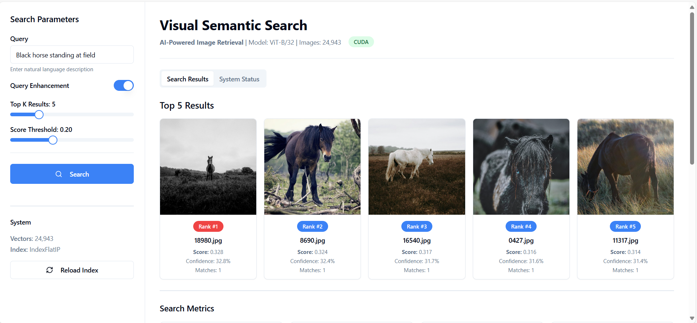

# Visual Semantic Search

# Application Architecture

# Cloud Architecture

# UI

---
## Overview

Visual Semantic Search is a full-stack AI application enabling semantic image search using OpenAI's CLIP model and FAISS vector indexing. It comprises:

- **Backend:** FastAPI server serving REST API endpoints, FAISS-based vector search, and static image files.
- **Frontend:** React app (Vite + shadcn/ui) providing an intuitive UI for search and result visualization.
- **Data:** Image assets, embeddings, metadata, and FAISS indices stored on disk.
- **Notebooks:** Jupyter notebooks for data prep, captioning, embedding creation, and index building.
- **Containerization:** Dockerfiles for backend and frontend, orchestrated with Docker Compose for local containerized dev/testing.
---
## Getting Started

### Prerequisites

- Python 3.10+
- Node.js 18+
- Docker & Docker Compose
- Optional GPU with appropriate CUDA for accelerated inference

### Install Dependencies Locally
Backend (optional outside Docker)
python3 -m venv .venv
source .venv/bin/activate
pip install -r requirements.txt

Frontend (optional outside Docker)
cd UI
npm install
npm run dev

---

## Running Locally with Docker Compose

### Build and Start Containers
docker-compose up --build

This will:

- Build the backend container from `Dockerfile.api`
- Build the React frontend container from `UI/Dockerfile`
- Expose Backend API at http://localhost:8000
- Expose Frontend React app at http://localhost:8080 (or 5173 based on your config)

---

## API Endpoints

- **GET /health:** Check system status and model info
- **POST /search:** Submit search query, parameters and receive ranked image results
- **POST /admin/reload:** Reload index and models without restarting server

---

## Dockerfile Examples

### Backend (`Dockerfile.api`)
FROM python:3.10-slim

WORKDIR /app

RUN apt-get update && apt-get install -y git

COPY requirements.txt .
RUN pip install --no-cache-dir -r requirements.txt

COPY app/ ./app/
COPY data/ ./data/
COPY scripts/ ./scripts/

EXPOSE 8000
CMD ["uvicorn", "app.main:app", "--host", "0.0.0.0", "--port", "8000"]

---

### Frontend (`UI/Dockerfile`)
FROM node:18-alpine

WORKDIR /app

COPY package*.json ./
RUN npm install

COPY . .

EXPOSE 5173

CMD ["npm", "run", "dev", "--", "--host"]

---

### Docker Compose (`docker-compose.yml`)
version: '3.8'
services:
backend:
build:
context: .
dockerfile: Dockerfile.api
ports:
- "8000:8000"
volumes:
- ./data:/app/data

frontend:
build: ./UI
ports:
- "5173:5173"
environment:
- VITE_API_BASE_URL=http://backend:8000
depends_on:
- backend

---

## Notes

- The backend container installs OpenAI’s CLIP repo directly from GitHub; `git` must be installed inside the container.
- React frontend picks up backend URL from environment variable (`VITE_API_BASE_URL`), which points to Docker Compose service name `backend`.
- Use `docker-compose down` to stop containers and `docker-compose logs -f` to tail logs.
- Adjust ports in Dockerfiles and Compose as necessary.

---

## License

MIT License

